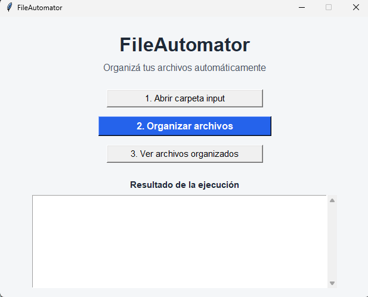

\# FileAutomator


Automatizador de archivos creado con Python. Clasifica documentos e imágenes por nombre o extensión, los organiza en carpetas y genera un registro de cada ejecución.




\## Funciones


\- Clasifica archivos cuyo nombre comienza con `factura`, `contrato` o `cliente`.

\- Organiza imágenes JPG, JPEG, PNG, GIF y WEBP.

\- Envía los archivos sin regla a la carpeta `otros`.

\- Crea automáticamente las carpetas de salida.

\- Evita sobrescribir archivos duplicados.

\- Genera un log en `logs/execution.log`.

\- Genera un reporte compatible con Excel en `reporte.csv`.


\## Estructura


```text

FileAutomator/

├── input/              # Archivos a procesar

├── output/             # Archivos organizados

│   ├── facturas/

│   ├── contratos/

│   ├── clientes/

│   ├── imagenes/

│   └── otros/

├── logs/

│   └── execution.log

├── fileautomator.py

├── reporte.csv

└── README.md

```


\## Requisitos


\- Python 3.10 o superior.

\- No requiere instalar librerías externas.


\## Uso


1\. Copiá los archivos que querés ordenar dentro de la carpeta `input`.

2\. Abrí una terminal dentro de `FileAutomator`.

3\. Ejecutá:


```bash

python fileautomator.py

```


4\. Revisá los archivos organizados dentro de `output`.

5\. Abrí `reporte.csv` con Excel para ver el detalle de la ejecución.


\## Reglas de clasificación


| Regla | Destino |

| --- | --- |

| El nombre comienza con `factura` | `output/facturas/` |

| El nombre comienza con `contrato` | `output/contratos/` |

| El nombre comienza con `cliente` | `output/clientes/` |

| Archivo JPG, JPEG, PNG, GIF o WEBP | `output/imagenes/` |

| Cualquier otro archivo | `output/otros/` |


\## Próximas mejoras


\- Reglas personalizadas desde un archivo de configuración.

\- Interfaz gráfica para usuarios no técnicos.

\- Procesamiento de Excel y CSV.

\- Copias de seguridad y archivos ZIP.

\- Integración con nube o SFTP.


\## Autor


Proyecto demo de automatización de archivos desarrollado con Python.

